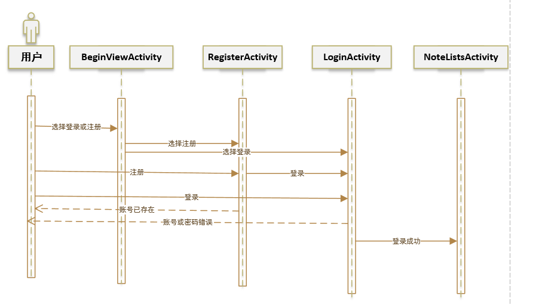
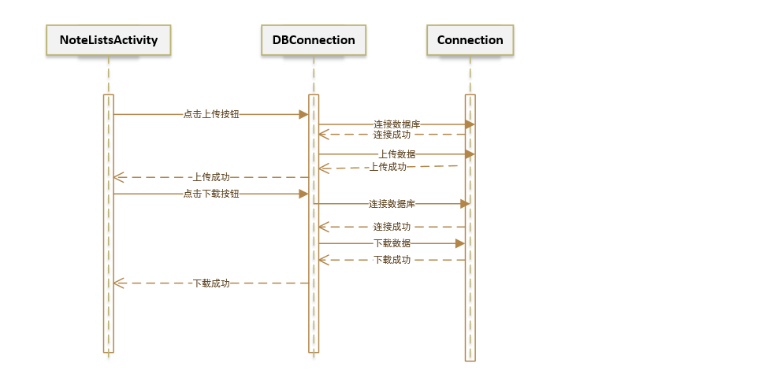
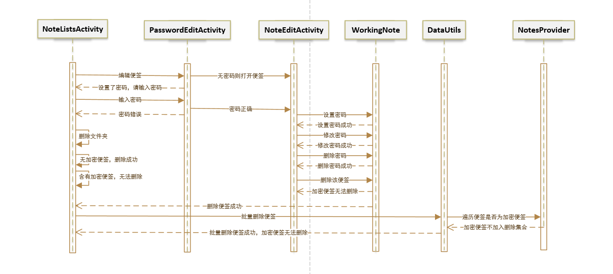
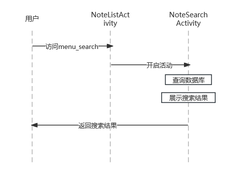

# Mi Note
## 项目来源
`MiCode`便签是小米便签的社区开源版，由MIUI团队(www.miui.com) 发起并贡献第一批代码，遵循NOTICE文件所描述的开源协议，今后为`MiCode`社区(www.micode.net) 拥有，并由社区发布和维护。

项目源地址：https://github.com/MiCode/Notes

## 环境配置

**Android Studio 2022.3**

**Gradle 8.1.3 **

**SDK 11**

**JDK 17**

**阿里云数据库 -- MySQL**

## 使用说明

可安装的程序包（apk文件） 在 release 文件下，直接安装运行。

## 新增功能介绍

### 1、登录注册功能



### 2、上传下载功能



### 3、加密文件功能

首先给`note`数据库添加属性`password locker`，当用户编辑便签，选择设置密码时，调用`setPassword`方法

```java
 if (itemId == R.id.menu_set_passwd) {
            setPassword();
 }
```

在`setPassword`中，首先定义对话框，以及对话框的布局和内容

```java
 //对话框
        final AlertDialog.Builder builder = new AlertDialog.Builder(this);
        final View view = LayoutInflater.from(this).inflate(R.layout.dialog_edit_text,null);
        //编辑Text
        final EditText etNameOld= (EditText)view.findViewById(R.id.old_password);//如果设置了密码，这是原密码
        etNameOld.setVisibility(view.GONE);
        final TextView etNameOld_View=(TextView)view.findViewById(R.id.old_password_view);
        etNameOld_View.setVisibility(view.GONE);
		//如果之前已经设置了密码
        if (mWorkingNote.hasPassword()){
            etNameOld.setVisibility(view.VISIBLE);
            etNameOld_View.setVisibility(view.VISIBLE);
            etNameOld.setText("");
            etNameOld.setHint("请输入原密码");
        }
        final EditText etName = (EditText)view.findViewById(R.id.new_password);//要设置的密码
        final EditText etNameAgain=(EditText)view.findViewById(R.id.new_password_again);//确认密码
        //final EditText finalEtNameOld = etNameOld;
        etName.setText("");
        etName.setHint("请输入密码");
        etNameAgain.setText("");
        etNameAgain.setHint("请确认密码");
        builder.setTitle("设置密码");
```

在点击ok 后进行错误判断和操作

```java
 builder.setPositiveButton("OK", new DialogInterface.OnClickListener() {
            @Override
            public void onClick(DialogInterface dialog, int which) {
                //获取输入的字符串
                String password = etName.getText().toString();
                String password_again=etNameAgain.getText().toString();
                String password_old = null;
                if (mWorkingNote.hasPassword()){
                    password_old= etNameOld.getText().toString();
                }
                //当输入原密码不对时
                if (mWorkingNote.hasPassword()) {
                    if(!password_old.equals(mWorkingNote.getmPassword())) {
                        Toast.makeText(NoteEditActivity.this, "原密码错误", Toast.LENGTH_SHORT).show();
                        return;
                    }
                }
                //当设置的密码为空的时候
                if (password==null || password.length()==0){
                    //关闭软键盘
                    InputMethodManager inputMethodManager = (InputMethodManager)
                            getSystemService(Context.INPUT_METHOD_SERVICE);
                    inputMethodManager.hideSoftInputFromWindow(etName.getWindowToken(),0);
                    dialog.dismiss();
                    Toast.makeText(NoteEditActivity.this, "密码不能为空", Toast.LENGTH_SHORT).show();
                    return;
                }
                //当确认密码不对时
                if (!password.equals(password_again)){
                    Toast.makeText(NoteEditActivity.this, "密码不一致", Toast.LENGTH_SHORT).show();
                    return;
                }
                //设置密码
                mWorkingNote.setPassword(password);
                mWorkingNote.setLocker("1");//设置密码标志为上锁
                //设置密码成功提示
                Toast.makeText(NoteEditActivity.this, "密码设置成功", Toast.LENGTH_SHORT).show();
                //关闭软键盘
                InputMethodManager inputMethodManager = (InputMethodManager)
                        getSystemService(Context.INPUT_METHOD_SERVICE);
                inputMethodManager.hideSoftInputFromWindow(etName.getWindowToken(),0);
                //关闭dialog
                dialog.dismiss();
            }
        });
```

点击取消按钮时，对应操作

```java
 builder.setNegativeButton("cancel", new DialogInterface.OnClickListener() {
            @Override
            public void onClick(DialogInterface dialog, int which) {
                //关闭软键盘
                InputMethodManager inputMethodManager = (InputMethodManager)
                        getSystemService(Context.INPUT_METHOD_SERVICE);
                inputMethodManager.hideSoftInputFromWindow(etName.getWindowToken(),0);
            }
        });
        final Dialog dialog = builder.setView(view).show();
        dialog.show();
    }
```




### 4、更换字体功能

```java
    public void showSingleAlertDiglog(){
        final String[] items = {"方正舒体","仿宋","黑体","隶书","行楷","幼圆"};
        //设置对话框
        AlertDialog.Builder alertBuilder = new AlertDialog.Builder(this);
        alertBuilder.setTitle("字体选择");
        alertBuilder.setSingleChoiceItems(items, 0, new DialogInterface.OnClickListener() {
            @Override
            public void onClick(DialogInterface dialog, int i) {
                //切换字体选择
                switch(i){
                    case 0:
                        Typeface typeface0 = Typeface.createFromAsset(getAssets(),"font/FZSTK.TTF");
                        mNoteEditor.setTypeface(typeface0);
                        break;
                    case 1:
                        Typeface typeface1 = Typeface.createFromAsset(getAssets(),"font/SIMYOU.TTF");
                        mNoteEditor.setTypeface(typeface1);
                        break;
                    case 2:
                        Typeface typeface2 = Typeface.createFromAsset(getAssets(),"font/STLITI.TTF");
                        mNoteEditor.setTypeface(typeface2);
                        break;
                    case 3:
                        Typeface typeface3 = Typeface.createFromAsset(getAssets(),"font/STXINGKA.TTF");
                        mNoteEditor.setTypeface(typeface3);
                        break;
                    case 4:
                        Typeface typeface4 = Typeface.createFromAsset(getAssets(),"font/simfang.ttf");
                        mNoteEditor.setTypeface(typeface4);
                        break;
                    case 5:
                        Typeface typeface5 = Typeface.createFromAsset(getAssets(),"font/simhei.ttf");
                        mNoteEditor.setTypeface(typeface5);
                        break;
                }
            }
        });
        //绑定按钮事件
        alertBuilder.setPositiveButton("确定", new DialogInterface.OnClickListener() {
            @Override
            public void onClick(DialogInterface dialog, int i) {
                alertDialog2.dismiss();
            }
        });
        alertBuilder.setNegativeButton("取消", new DialogInterface.OnClickListener() {
            @Override
            public void onClick(DialogInterface dialog, int i) {
                alertDialog2.dismiss();
            }
        });
        alertDialog2 = alertBuilder.create();
        alertDialog2.show();
    }
```


### 5、实时模糊搜索功能

首先在`layout`创建一个`note_search_list.xml` , 显示搜索界面

```xml
<?xml version="1.0" encoding="utf-8"?>
<LinearLayout xmlns:android="http://schemas.android.com/apk/res/android"
    android:orientation="vertical"
    android:layout_width="match_parent"
    android:layout_height="match_parent">
    <SearchView
        android:id="@+id/search_view"
        android:layout_width="match_parent"
        android:layout_height="wrap_content"
        android:iconifiedByDefault="false"
        android:queryHint="输入搜索内容..."
        android:layout_alignParentTop="true">
    </SearchView>
    <ListView
        android:id="@android:id/list"
        android:layout_width="match_parent"
        android:layout_height="wrap_content">
    </ListView>

</LinearLayout>
```

在新建一个`notelist_item.xml`，用于显示搜索结果

```xml
<?xml version="1.0" encoding="utf-8"?>
<!-- Copyright (C) 2010 The Android Open Source Project

     Licensed under the Apache License, Version 2.0 (the "License");
     you may not use this file except in compliance with the License.
     You may obtain a copy of the License at

          http://www.apache.org/licenses/LICENSE-2.0

     Unless required by applicable law or agreed to in writing, software
     distributed under the License is distributed on an "AS IS" BASIS,
     WITHOUT WARRANTIES OR CONDITIONS OF ANY KIND, either express or implied.
     See the License for the specific language governing permissions and
     limitations under the License.
-->
<!--添加一个垂直的显示布局-->
<LinearLayout  xmlns:android="http://schemas.android.com/apk/res/android"
    android:id="@+id/layout"
    android:layout_width="match_parent"
    android:layout_height="match_parent"
    android:orientation="vertical">

    <TextView xmlns:android="http://schemas.android.com/apk/res/android"
        android:id="@android:id/text1"
        android:layout_width="match_parent"
        android:layout_height="?android:attr/listPreferredItemHeight"
        android:textAppearance="?android:attr/textAppearanceLarge"
        android:gravity="center_vertical"
        android:paddingLeft="5dip"
        android:singleLine="true"
        />
    <!--添加 显示时间 的TextView-->
    <TextView
        android:id="@+id/text1_time"
        android:layout_width="match_parent"
        android:layout_height="wrap_content"
        android:textAppearance="?android:attr/textAppearanceSmall"
        android:paddingLeft="5dip" />
</LinearLayout>
```

在`NoteListActivity`中`onOptionsItemSelected`中添加开启activity

```java
if (itemId == R.id.menu_search) {
            onSearchRequested();
            return true;
        }

@Override
    public boolean onSearchRequested() {
        Intent intent = new Intent();
        intent.setClass(NotesListActivity.this,NoteSearch.class);
        NotesListActivity.this.startActivity(intent);
        return true;
    }

```

`NoteSearch` 首先继承 `ListActivity `用于显示结果的垂直布局，在实现`SearchView.OnQueryTextListener`,用于搜索查询。

```java
@SuppressLint("NewApi")
public class NoteSearch extends ListActivity implements SearchView.OnQueryTextListener {
    @Override
    protected void onCreate(Bundle savedInstanceState) {
        super.onCreate(savedInstanceState);
        setContentView(R.layout.note_search_list);
        Intent intent = getIntent();
        if (intent.getData() == null) {
            intent.setData(Notes.CONTENT_NOTE_URI);
        }
        SearchView searchview = (SearchView)findViewById(R.id.search_view);
        //为查询文本框注册监听器
        searchview.setOnQueryTextListener(NoteSearch.this);
    }
    @Override
    public boolean onQueryTextSubmit(String s) {
        return false;
    }

    @Override
    public boolean onQueryTextChange(String s) {
        // 获取用户在搜索框中输入的文本
        String searchText = "%" + s + "%";

        // 创建内容提供者 URI
        Uri contentUri = Notes.CONTENT_NOTE_URI;

        // 执行查询操作，小米便签中 在NoteProvider中已经封装好搜索的功能，使用ContentResolver 调用对应的方法即可
        ContentResolver resolver = getContentResolver();
        String[] projection = NoteItemData.PROJECTION;
        String selection = Notes.NoteColumns.SNIPPET + " Like ? ";
        String[] selectionArgs = { searchText };
        Cursor cursor = resolver.query(contentUri, projection, selection, selectionArgs, null);
        String[] dataColumns = { Notes.NoteColumns.SNIPPET , Notes.NoteColumns.MODIFIED_DATE};
        int[] viewIDs = { android.R.id.text1 , R.id.text1_time };

        MyCursorAdapter adapter = new MyCursorAdapter(
                this,
                R.layout.noteslist_item,
                cursor,
                dataColumns,
                viewIDs
        );
        setListAdapter(adapter);
        return true;
    }

    @Override
    protected void onListItemClick(ListView l, View v, int position, long id) {

        // Constructs a new URI from the incoming URI and the row ID
        Uri uri = ContentUris.withAppendedId(getIntent().getData(), id);

        // Gets the action from the incoming Intent
        String action = getIntent().getAction();

        // Handles requests for note data
        if (Intent.ACTION_PICK.equals(action) || Intent.ACTION_GET_CONTENT.equals(action)) {

            // Sets the result to return to the component that called this Activity. The
            // result contains the new URI
            setResult(RESULT_OK, new Intent().setData(uri));
        } else {

            // Sends out an Intent to start an Activity that can handle ACTION_EDIT. The
            // Intent's data is the note ID URI. The effect is to call NoteEdit.
            startActivity(new Intent(Intent.ACTION_EDIT, uri));
        }
    }
}

```

在`MyCursorAdapter`中，对样式进行处理

```java
public class MyCursorAdapter extends SimpleCursorAdapter {

    public MyCursorAdapter(Context context, int layout, Cursor c, String[] from, int[] to) {
        super(context, layout, c, from, to);
    }
}
```




### 6、更换背景图片功能

首先添加item表示图片切换，`menu\note_list.xml`

```xml
<item
        android:id="@+id/Lisa"
        android:title="@string/menu_Lisa"/>
    <item
        android:id="@+id/Rose"
        android:title="@string/menu_Rose"/>
    <item
        android:id="@+id/Waiwai"
        android:title="@string/menu_Waiwai"/>
    <item
        android:id="@+id/background_default"
        android:title="@string/menu_background_default"/>
```

然后再`NoteListActivity`中，首先在`onCreate`方法中，设置默认背景

```java
getWindow().setBackgroundDrawableResource(R.drawable.background_default);
```

然后添加变量`mode`用于切换页面，在`onOptionsItemSelected`方法中设置切换背景

```java
		if(itemId == R.id.background_default){
            mode = -2;
            getWindow().setBackgroundDrawableResource(R.drawable.background_default);
        }
        else if(itemId == R.id.Rose){
            mode = -1;
            getWindow().setBackgroundDrawableResource(R.drawable.rose);
        }
        else if(itemId == R.id.Lisa){
            mode = 0;
            getWindow().setBackgroundDrawableResource(R.drawable.lisa);
        }
        else if(itemId == R.id.Waiwai){
            mode = 1;
            getWindow().setBackgroundDrawableResource(R.drawable.waiwai);
        }
```

最后在`onPrepareOptionsMenu`设置按键隐藏

```java
if(mode == -1)
     menu.findItem(R.id.Rose).setVisible(false);
else if(mode == 0)
     menu.findItem(R.id.Lisa).setVisible(false);
else if(mode == 1)
     menu.findItem(R.id.Waiwai).setVisible(false);
else if(mode == -2)
     menu.findItem(R.id.background_default).setVisible(false);
```

### 7、插入图片功能

首先，在`note_edit`中添加插入图片按钮

```xml
 <ImageButton
        android:id="@+id/add_img_btn"
        android:layout_width="wrap_content"
        android:layout_height="wrap_content"
        android:layout_marginLeft="10dp"
        android:layout_marginTop="500dp"
        android:layout_marginBottom="7dp"
        android:src="@android:drawable/ic_menu_gallery"
        tools:ignore="TouchTargetSizeCheck,SpeakableTextPresentCheck"/>
```

`NoteEditActivity`中`onCreate`中为按钮绑定监听器

```java
//根据id获取添加图片按钮
        final ImageButton add_img_btn = (ImageButton) findViewById(R.id.add_img_btn);
        //为点击图片按钮设置监听器
        add_img_btn.setOnClickListener(new View.OnClickListener() {
            @Override
            public void onClick(View view) {
                Log.d(TAG, "onClick: click add image button");
                //ACTION_GET_CONTENT: 允许用户选择特殊种类的数据，并返回（特殊种类的数据：照一张相片或录一段音）
                Intent loadImage = new Intent(Intent.ACTION_GET_CONTENT);
                //Category属性用于指定当前动作（Action）被执行的环境.
                //CATEGORY_OPENABLE; 用来指示一个ACTION_GET_CONTENT的intent
                loadImage.addCategory(Intent.CATEGORY_OPENABLE);
                loadImage.setType("image/*");
                startActivityForResult(loadImage, PHOTO_REQUEST);
            }
        });
```

重写`onActivityResult`方法

```java
 @Override
    protected void onActivityResult(int requestCode, int resultCode, Intent intent) {
        super.onActivityResult(requestCode, resultCode, intent);
        ContentResolver resolver = getContentResolver();
        switch (requestCode) {
            case PHOTO_REQUEST:
                Uri originalUri = intent.getData(); //1.获得图片的真实路径
                Bitmap bitmap = null;
                try {
                    bitmap = BitmapFactory.decodeStream(resolver.openInputStream(originalUri));//2.解码图片
                } catch (FileNotFoundException e) {
                    Log.d(TAG, "onActivityResult: get file_exception");
                    e.printStackTrace();
                }

                if(bitmap != null){
                    //3.根据Bitmap对象创建ImageSpan对象
                    Log.d(TAG, "onActivityResult: bitmap is not null");
                    ImageSpan imageSpan = new ImageSpan(NoteEditActivity.this, bitmap);
                    String path = getPath(this,originalUri);
                    //4.使用[local][/local]将path括起来，用于之后方便识别图片路径在note中的位置
                    String img_fragment= "[local]" + path + "[/local]";
                    //创建一个SpannableString对象，以便插入用ImageSpan对象封装的图像
                    SpannableString spannableString = new SpannableString(img_fragment);
                    spannableString.setSpan(imageSpan, 0, img_fragment.length(), Spannable.SPAN_EXCLUSIVE_EXCLUSIVE);
                    //5.将选择的图片追加到EditText中光标所在位置
                    NoteEditText e = (NoteEditText) findViewById(R.id.note_edit_view);
                    int index = e.getSelectionStart(); //获取光标所在位置
                    Log.d(TAG, "Index是: " + index);
                    Editable edit_text = e.getEditableText();
                    edit_text.insert(index, spannableString); //将图片插入到光标所在位置

                    mWorkingNote.mContent = e.getText().toString();
                    //6.把改动提交到数据库中,两个数据库表都要改的
                    ContentResolver contentResolver = getContentResolver();
                    ContentValues contentValues = new ContentValues();
                    final long id = mWorkingNote.getNoteId();
                    contentValues.put("snippet",mWorkingNote.mContent);
                    contentResolver.update(Uri.parse("content://micode_notes/note"), contentValues,"_id=?",new String[]{""+id});
                    ContentValues contentValues1 = new ContentValues();
                    contentValues1.put("content",mWorkingNote.mContent);
                    contentResolver.update(Uri.parse("content://micode_notes/data"), contentValues1,"mime_type=? and note_id=?", new String[]{"vnd.android.cursor.item/text_note",""+id});

                }else{
                    Toast.makeText(NoteEditActivity.this, "获取图片失败", Toast.LENGTH_SHORT).show();
                }
                break;
            default:
                break;
        }
    }
```

获取图片路径

```java
//获取文件的real path
    public String getPath(final Context context, final Uri uri) {

        final boolean isKitKat = Build.VERSION.SDK_INT >= Build.VERSION_CODES.KITKAT;

        // DocumentProvider
        if (isKitKat && DocumentsContract.isDocumentUri(context, uri)) {
            if (isMediaDocument(uri)) {
                final String docId = DocumentsContract.getDocumentId(uri);
                final String[] split = docId.split(":");
                final String type = split[0];

                Uri contentUri = null;
                if ("image".equals(type)) {
                    contentUri = MediaStore.Images.Media.EXTERNAL_CONTENT_URI;
                }

                final String selection = "_id=?";
                final String[] selectionArgs = new String[]{split[1]};

                return getDataColumn(context, contentUri, selection, selectionArgs);
            }
        }
        // Media
        else if ("content".equalsIgnoreCase(uri.getScheme())) {
            return getDataColumn(context, uri, null, null);
        }
        // File
        else if ("file".equalsIgnoreCase(uri.getScheme())) {
            return uri.getPath();
        }
        return null;
    }
```

判断是否为媒体文件

```java
//是否为媒体文件
    public boolean isMediaDocument(Uri uri) {
        return "com.android.providers.media.documents".equals(uri.getAuthority());
    }

    /**
     * Current activity may be killed when the memory is low. Once it is killed, for another time
     * user load this activity, we should restore the former state
     */
    @Override
    protected void onRestoreInstanceState(Bundle savedInstanceState) {
        super.onRestoreInstanceState(savedInstanceState);
        if (savedInstanceState != null && savedInstanceState.containsKey(Intent.EXTRA_UID)) {
            Intent intent = new Intent(Intent.ACTION_VIEW);
            intent.putExtra(Intent.EXTRA_UID, savedInstanceState.getLong(Intent.EXTRA_UID));
            if (!initActivityState(intent)) {
                finish();
                return;
            }
            Log.d(TAG, "Restoring from killed activity");
        }
    }
```

获取列内容

```java
 //获取数据列_获取此 Uri 的数据列的值。这对MediaStore Uris 和其他基于文件的 ContentProvider。
    public String getDataColumn(Context context, Uri uri, String selection, String[] selectionArgs) {

        Cursor cursor = null;
        final String column = "_data";
        final String[] projection = {column};

        try {
            cursor = context.getContentResolver().query(uri, projection, selection, selectionArgs, null);
            if (cursor != null && cursor.moveToFirst()) {
                final int column_index = cursor.getColumnIndexOrThrow(column);
                return cursor.getString(column_index);
            }
        } finally {
            if (cursor != null)
                cursor.close();
        }
        return null;
    }
```

